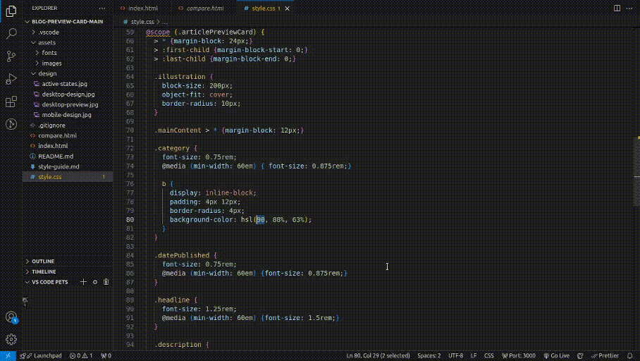

# Compare Code x Design Tool

Provides a simple HTML interface for comparing your code output to design mock-ups using the [two-up component](https://github.com/GoogleChromeLabs/two-up). The interface allows users to switch between a mobile design and a desktop design, and includes a "Diff" mode to highlight differences between the two.


*I'm also using the [Live Preview](https://marketplace.visualstudio.com/items?itemName=ms-vscode.live-server) extension, but you can just open it in the browser too.

**Live Demo**: https://lucarle.github.io/frontend-mentor--qr-code-component/compare.html

## How to use

1. Include the compare.html file and ensure your directory structure is as follows:

```
project-directory/
├── design/
│   ├── mobile-design.jpg
│   ├── desktop-design.jpg
├── index.html
└── compare.html
```

2. Open compare.html in browser.

3. Switch between desktop and mobile views by changing the viewport width. By default, desktop mode starts at 1440px.

